# ⚙️ AWS CloudFormation for Infrastructure as Code

> Automate AWS infrastructure using CloudFormation and YAML templates to deploy EC2, S3, and RDS with Infrastructure as Code (IaC).

---

## 📘 Project Summary

In this project, I used AWS CloudFormation to automate and manage cloud infrastructure. Instead of manually creating resources, I wrote templates in YAML format and deployed EC2, S3, and RDS automatically. Below is the step-by-step process I followed.

---

## 🧱 File Used

📄 Template Used: [my-cloudformation-template.yaml](templates/my-cloudformation-template.yaml)


---

## ✅ Step-by-Step Process

### 🔹 Step 1: Create a CloudFormation Template

First, I created a simple YAML file (template) that includes definitions for:

- EC2 Instance  
- S3 Bucket  
- RDS Database (MySQL)

📁 File Name: my-cloudformation-template.yaml

```yaml
# my-cloudformation-template.yaml
AWSTemplateFormatVersion: '2010-09-09'
Description: "Deploy EC2, S3, and RDS using CloudFormation"

Resources:

  MyS3Bucket:
    Type: AWS::S3::Bucket
    Properties:
      BucketName: my-cloudformation-s3-bucket-vishwaraj-0413  # Replace with your S3 Bucket name

  MyEC2Instance:
    Type: AWS::EC2::Instance
    Properties:
      ImageId: ami-080b1a55a0ad28c02  # Amazon Linux 2 AMI (check for your region)
      InstanceType: t2.micro
      KeyName: test-key       # Replace with your EC2 key pair name
      SecurityGroups:
       - default

  MyRDSInstance:
    Type: AWS::RDS::DBInstance
    Properties:
      DBInstanceIdentifier: mydbinstance
      AllocatedStorage: 20
      DBInstanceClass: db.t3.micro
      Engine: MTSQL
      MasterUsername: adminuser
      MasterUserPassword: mysecurepassword
      PubliclyAccessible: true
```

<p align="center">
  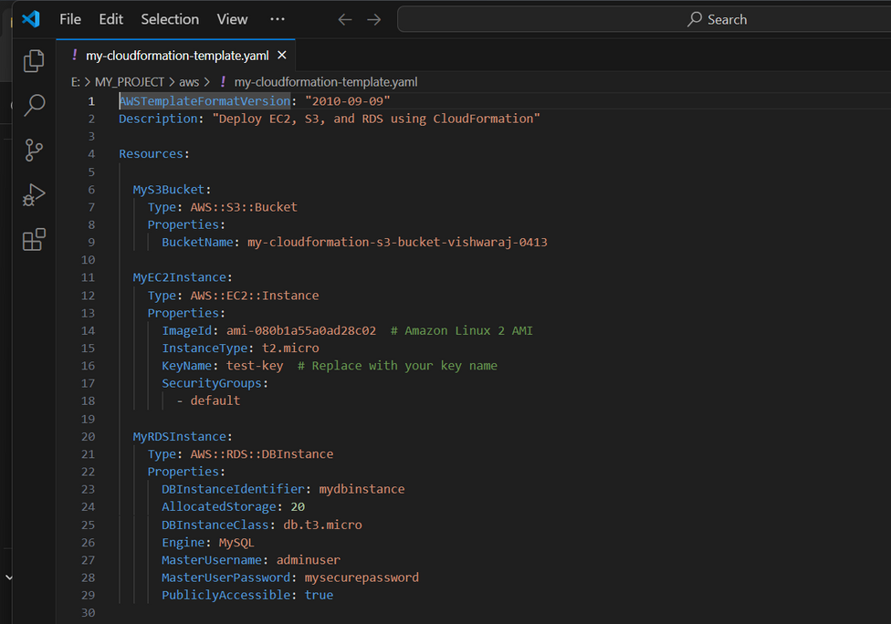
  <br>
  <em>Figure: CloudFormation Template Yaml Code</em>
</p>

---

### 🔹 Step 2: Upload the Template to AWS

- Go to AWS Console → **CloudFormation**
- Click "Create stack" → "**With new resources (standard)**"
- Choose "**Upload a template file**"
- Upload the YAML file
- Click **Next**

<p align="center">
  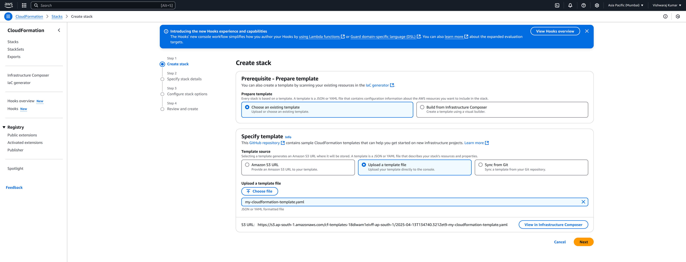
  <br>
  <em>Figure: Create stack and Upload a YAML template file</em>
</p>

---

### 🔹 Step 3: Configure Stack Details

- **Stack Name**: my-infra-stack
- Click**Next** (keep default settings)

<p align="center">
  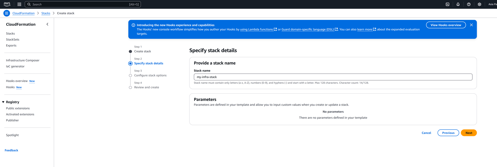
  <br>
  <em>Figure: Configure Stack Details</em>
</p>

---

### 🔹 Step 4: Review and Launch

- Review all resources listed
- Click **Create stack**

<p align="center">
  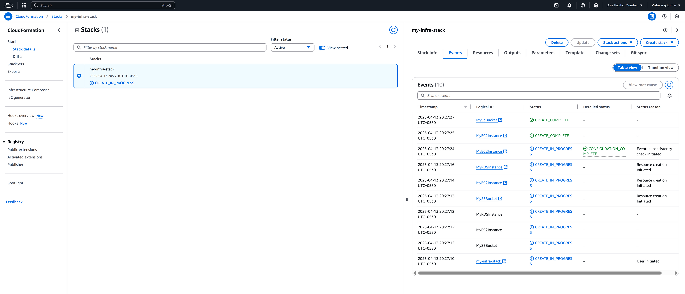
  <br>
  <em>Figure: Review and Launch Stack</em>
</p>

---

### 🔹 Step 5: Wait for Stack Creation

- Stack status will show as CREATE_IN_PROGRESS
- After a few minutes, it changes to CREATE_COMPLETE

<p align="center">
  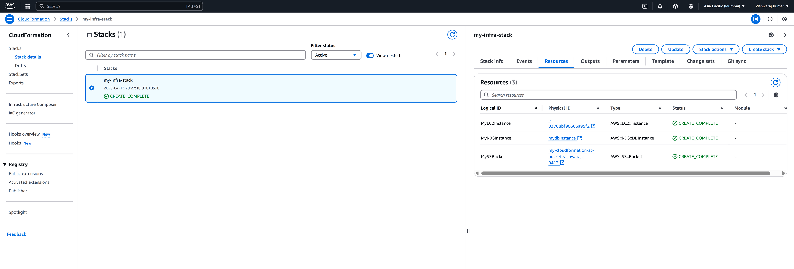
  <br>
  <em>Figure: Stack Creation Status Check</em>
</p>

---

### 🔹 Step 6: Verify the Resources

I verified the resources in their respective AWS services:

- **EC2 Instance** → Go to EC2 → Instances

<p align="center">
  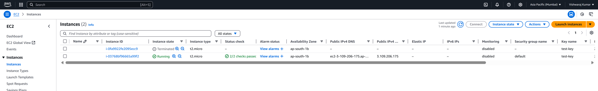
  <br>
  <em>Figure: EC2 Instance Create Successfully</em>
</p>

- **S3 Bucket** → Go to S3 → Buckets

<p align="center">
  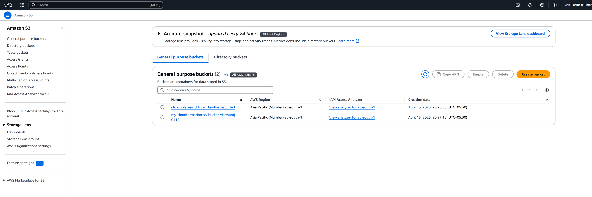
  <br>
  <em>Figure: S3 Bucket Create Successfully</em>
</p>

- **RDS Database** → Go to RDS → Databases

<p align="center">
  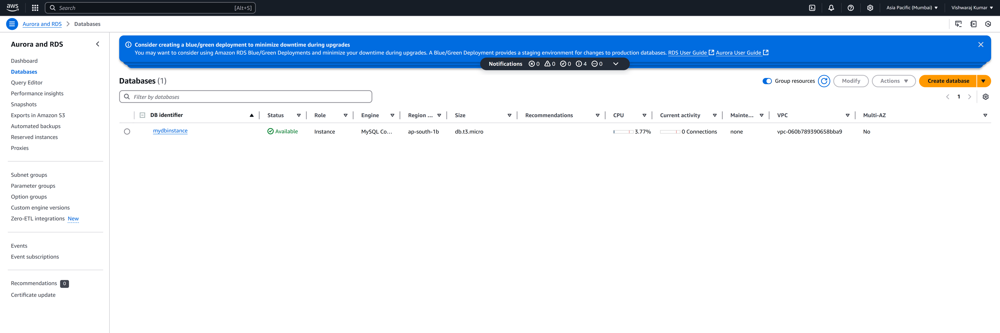
  <br>
  <em>Figure: RDS Database Create Successfully</em>
</p>

---

### 🔹 Step 7: Update the Stack (Optional)

Later, I updated my template to change the EC2 instance type and re-deployed it using Update Stack option in CloudFormation.

<p align="center">
  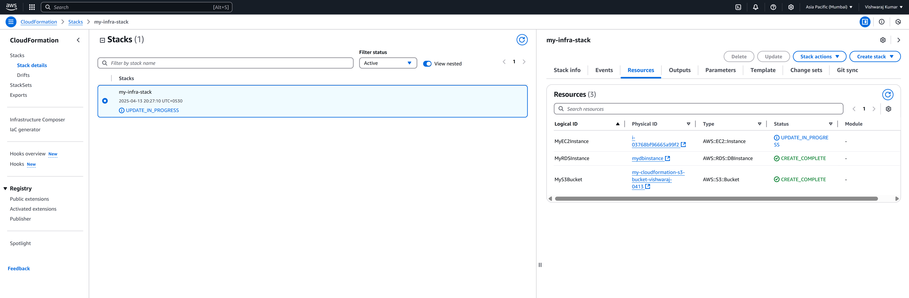
  <br>
  <em>Figure: Update the Stack</em>
</p>

<p align="center">
  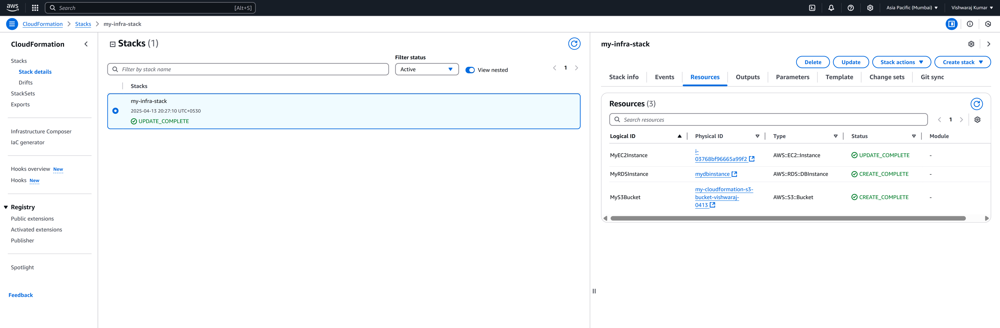
  <br>
  <em>Figure: Stack Update Complete Successfully</em>
</p>

---

### 🔹 Step 8: Delete the Stack (Cleanup)

After testing, I deleted the entire stack using Delete Stack option — this automatically deleted all the resources created by the template.

<p align="center">
  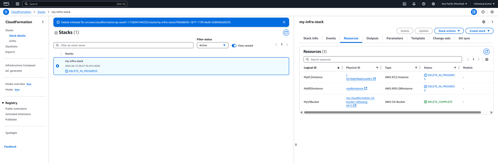
  <br>
  <em>Figure: Resources Delete in progress</em>
</p>

<p align="center">
  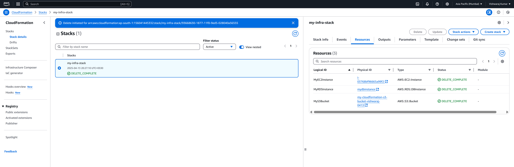
  <br>
  <em>Figure: Resources Delete Complete</em>
</p>

---

## 📌 Conclusion

In this project, I used AWS CloudFormation to automate the deployment of resources like EC2, S3, and RDS. This allowed me to manage infrastructure with Infrastructure as Code (IaC), ensuring consistency, scalability, and easier updates. The project helped me understand the power of automation in cloud environments and gave me hands-on experience in managing and troubleshooting cloud resources efficiently.

## 📝 Final Notes:

- I used YAML syntax for better readability.
- The entire infrastructure is now version-controlled and can be reused or shared easily.
- It saves time, reduces manual errors, and follows best practices for DevOps.

---

## ✍️ Author

**Vishwaraj Kumar**  
🔗 [GitHub Profile](https://github.com/vishwaraj-kumar)  
🔗 [LinkedIn Profile](https://www.linkedin.com/in/vishwaraj-kumar/)
